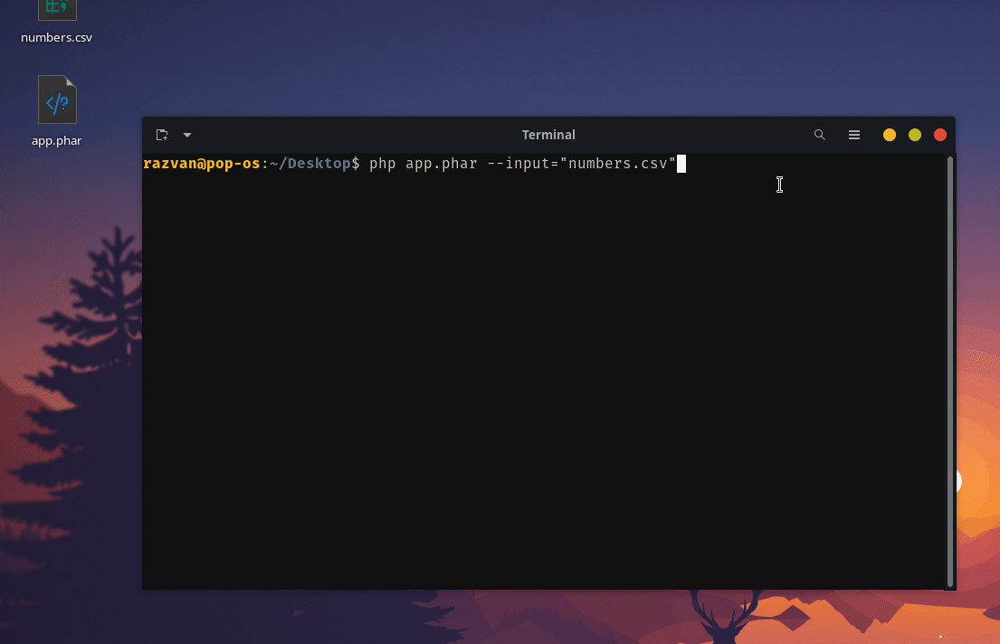
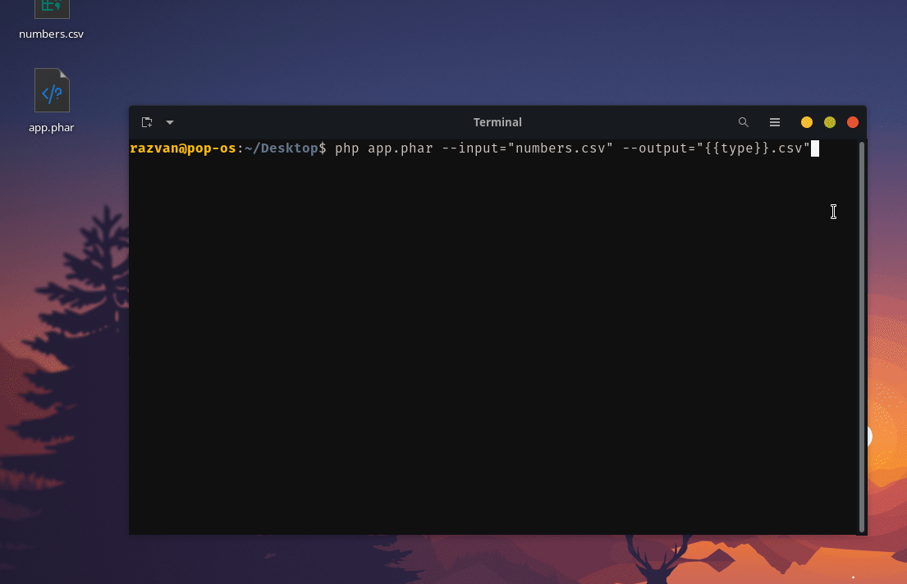

# Premise

This project has only been tested on Ubuntu (PopOS) and Windows 11.

# Getting Started

Php8.1+ and the following extensions are required

- ext-yaml (`sudo apt install php8.1-yaml`)
- ext-phar (`sudo apt install php8.1-phar`)
- ext-xdebug (`sudo apt install php8.1-xdebug`)

I suggest you also install `sudo apt install php8.1-curl`.


## Prebuilt binaries

You can download the prebuilt binaries from [here](https://github.com/tncrazvan/testprsel/releases).
## Build from source

You can also build the project on your own from the srouce code.

You will need `composer ^2` and `node ^16`.

Once you made sure both are installed on your machine

- clone the repository
- download and install the latest php and js dependencies
- build the client library
- build the whole application

```sh
git clone https://github.com/tncrazvan/testprsel.git && \
cd testprsel && \
composer update && \
cd client && \
npm i && \
npm run build && \
cd .. & \
composer build
```

The process should output an `app.phar` file.


# Notes 
> **Note** This projects provides both a web server and cli tool.

> **Note** Tests can be run with `composer action:test` or `composer test` (for debugging).

> **Note** The program has different options:<br/>
> >
> For `CLI MODE`
> | Option | Description |
> |--------|-------------|
> | `--input` | name of the file to parse |
> | `--output` | name of the output file, defaults to `{{type}}.json`.<br />The `{{type}}` part will be resolved to 3 different filenames: `acceptable.json`, `successful-corrections.json`, `failed-corrections.json`.<br/>If the filename ends with `.csv` the results witll be encoded as proper `csv` content. |
> 
> For `SERVER MODE`
> | Option | Description |
> |--------|-------------|
> | `--serve` | run the web server |


# Cli Tool Example

Run the tool and feed it a filename `numbers.csv`.
```sh
php app.har --input="numbers.csv"
```

This will generate 3 different `json` files

- `acceptable.json`
- `successful-corrections.json`
- `failed-corrections.json`




You can generate `csv` files instead of `json` files by specifying an `--output` that ends with `.csv`

```sh
php app.har --input="numbers.csv" --output="{{type}}.csv"
```

This will generate 3 different `csv` files

- `acceptable.csv`
- `successful-corrections.csv`
- `failed-corrections.csv`



# Web Server Example

Run the server with 

```sh
php app.phar --serve
```

Your server will be exposed on interface `127.0.0.1:8000` with `http`.

- Open the website and pick a file<br/>
  
- Click `Upload`
- Check the resulting tables for `Acceptable`, `Successful Correction` and `Failed Corrections`<br/>
  

You can also test a given number using the top right `Test` button<br/>


---

Powered by [Catpaw](https://github.com/tncrazvan/catpaw-core)
